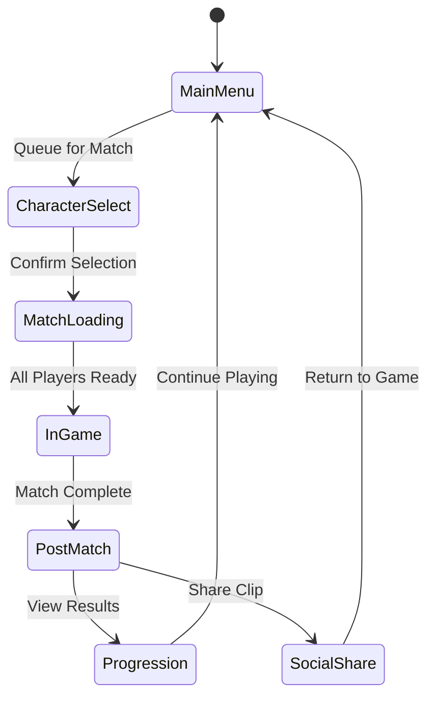

# User Interface & Experience

## Mobile-First Design Principles

### Touch-Friendly Interface
- **Thumb-Friendly Navigation**: All UI elements within natural thumb reach zones
- **Gesture-Based Controls**: Swipe, tap, and hold for common actions
- **Readable Text**: Minimum 16sp font size with high contrast ratios
- **Performance Optimization**: 60fps UI with minimal battery drain

### Cross-Platform Consistency
- **Unified Experience**: Core UI patterns work identically across platforms
- **Platform Adaptations**: Touch-specific optimizations for mobile
- **Responsive Layout**: UI scales appropriately for different screen sizes
- **Input Method Adaptation**: Keyboard, mouse, gamepad, and touch support

## Player Journey Flow

### First-Time User Experience (0-5 minutes)

#### Onboarding Sequence
1. **Splash Screen** (5s) - Meme-heavy branding with audio
2. **Account Creation** (30s) - Social login or guest play
3. **Character Introduction** (45s) - Elom Nusk vs DOGE showcase
4. **Training Match** (90s) - AI opponents, core mechanics tutorial
5. **First PvP Match** (180s) - Matchmade 3v3 with new players
6. **Progression Unlock** (15s) - Cosmetic reward + battle pass introduction
7. **Social Integration** (15s) - Friend invite bonus + clip sharing

### Core Gameplay Loop (5-60 minutes)

## UI Component Architecture

### UI Architecture Patterns (Based on Game Programming Patterns)

**Technical Implementation:** See [TECHNICAL.md](TECHNICAL.md) for complete pattern implementations including Observer, Command, Flyweight, and Object Pool patterns used throughout the UI system.

**Cross-Reference:** For input handling patterns, see [CONTROLS.md - Input System Architecture](CONTROLS.md#input-system-architecture).

#### UI Pattern Overview
- **Model-View-Controller (MVC)**: Separation of UI data, presentation, and control logic
- **Observer Pattern**: Event-driven UI updates via UINotificationCenter  
- **Command Pattern**: Undoable UI actions and input handling
- **Flyweight Pattern**: Memory-efficient UI element sharing
- **Object Pool Pattern**: UI component reuse for performance
- **Strategy Pattern**: Multiple UI rendering strategies per platform

#### Model-View-Controller (MVC) Pattern Implementation

**Complete Implementation:** See [TECHNICAL.md - Component Architecture](TECHNICAL.md#component-architecture) for full MVC implementation examples with CharacterUIModel, HealthBarView, and CharacterUIController classes.

**UI-Specific Benefits:**
- **Separation of Concerns**: UI logic separated from game logic
- **Testability**: UI components can be tested independently
- **Maintainability**: Changes to UI don't affect underlying game systems
- **Reusability**: UI models can be shared across different views

#### Command Pattern for UI Actions

**Complete Implementation:** See [TECHNICAL.md - Command Pattern](TECHNICAL.md#command-pattern-for-input-and-abilities) for detailed command interfaces and UI command management systems.

**UI-Specific Applications:**
- **Undoable Actions**: Ability upgrades, settings changes, purchase confirmations
- **Input Buffering**: UI input queuing during loading or transition states
- **Macro Recording**: Complex UI action sequences for accessibility
- **Transaction Safety**: Atomic UI operations with rollback capability

#### Observer Pattern for UI Event System

**Complete Implementation:** See [TECHNICAL.md - Observer Pattern](TECHNICAL.md#event-system-architecture) for full EventBus implementation and notification system.

**UI Event Examples:**
- **Health Changes**: Automatic UI updates when character health changes
- **Ability Cooldowns**: Real-time cooldown progress updates
- **Score Updates**: Live score display during matches
- **Achievement Unlocks**: Immediate visual feedback for player achievements

### HUD Design
- **Minimalist Approach**: Clean, unobtrusive interface during gameplay
- **Contextual Information**: Show relevant data based on game state
- **Performance Indicators**: Health, mana, ability cooldowns, mini-map
- **Accessibility Options**: High contrast, scalable text, colorblind support

### Ability System UI
- **Ability Icons**: Clear visual representation of each ability
- **Cooldown Indicators**: Visual and numerical cooldown tracking
- **Targeting Feedback**: Reticle and range indicators for manual aim
- **Quick Cast Options**: Alternative casting methods for accessibility

### Scoring Interface
- **Left Alt Interaction**: Contextual UI when near scoring zones
- **Progress Visualization**: Time-based progress bars for coin deposits
- **Team Synergy Display**: Visual feedback for multiple player assistance
- **Risk Indicators**: Visual cues for vulnerability during scoring

## Social Features UI

### In-Game Social
- **Quick Chat**: Preset meme-based communication options
- **Voice Chat**: Push-to-talk with platform-appropriate defaults
- **Ping System**: Contextual map communication (attack, defend, etc.)
- **Emote System**: Unlockable animations and gestures

### Meta-Game Social
- **Friend System**: Add players, view activity, invite to matches
- **Clan/Team Creation**: Persistent groups with shared progression
- **Spectator Mode**: Watch friends' matches with commentary tools
- **Tournament Brackets**: User-generated competitive events

### Content Sharing
- **Auto-Highlight Generation**: AI identifies shareable moments
- **Clip Trimming Tools**: Basic video editing for social media
- **Achievement Screenshots**: Automatic captures of milestone moments
- **Custom Lobby Codes**: Easy sharing of private matches

## Accessibility Implementation

### Visual Accessibility
- **Colorblind Support**: Use shapes/patterns instead of color coding
- **High Contrast Mode**: Enhanced visibility for low vision users
- **Scalable UI**: Text and UI scaling from 75% to 150%
- **Motion Reduction**: Option to disable screen shake and particles
- **Enlarged Indicators**: Bigger targeting reticles and UI elements

### Motor Accessibility
- **Hold-to-Toggle**: Convert hold inputs to toggle for limited dexterity
- **Customizable Controls**: Remap all input bindings including ability hold-to-aim
- **Auto-Aim Assist**: Enhanced targeting assistance for disabilities
- **One-Handed Mode**: Ability clustering and gesture shortcuts for mobile
- **Difficulty Adjustments**: AI assistance options for manual aim abilities

### Cognitive Accessibility
- **Simplified HUD Options**: Reduce information density for focus
- **Tutorial Replay**: Re-watch training content at any time
- **Terminology Glossary**: In-game definitions for all game terms
- **Visual Indicators**: Clear telegraphs for all abilities and interactions
- **Pause in Training**: Training modes allow pausing during aim tutorials

## Platform-Specific UI Adaptations

### Mobile UI Optimization
- **Touch Targets**: Minimum 44px touch targets for accessibility
- **Gesture Support**: Swipe, pinch, and multi-touch gestures
- **Virtual Controls**: On-screen joysticks and buttons
- **Battery Optimization**: Reduced animations and effects for power saving

### PC UI Features
- **Mouse Optimization**: Hover states and tooltips
- **Keyboard Shortcuts**: Quick access to common functions
- **Window Management**: Resizable windows and multi-monitor support
- **Advanced Spectating**: Full spectator controls and analysis tools

### Console UI Design
- **Controller Navigation**: D-pad and analog stick navigation
- **Haptic Feedback**: Controller vibration for UI interactions
- **Quick Access**: Shoulder button shortcuts for common actions
- **TV Optimization**: Larger text and UI elements for TV viewing

## Performance Considerations

### UI Rendering Optimization
- **Frame Budget**: UI rendering within 2ms per frame
- **Draw Calls**: Minimize UI draw calls through atlas optimization
- **Memory Usage**: Efficient texture and font loading
- **Animation Performance**: GPU-accelerated animations where possible

### Mobile-Specific Optimizations
- **Battery Impact**: Reduced refresh rates during UI transitions
- **Memory Constraints**: Texture streaming and unloading
- **Network Efficiency**: Minimal UI data transmission
- **Thermal Management**: Reduced processing during sustained use

## Testing and Validation

### Usability Testing
- **User Journey Validation**: Test complete user flows from download to match
- **Accessibility Audit**: WCAG compliance testing with assistive technologies
- **Cross-Platform Consistency**: Verify identical experience across devices
- **Performance Validation**: UI performance under various conditions

### A/B Testing Framework
- **UI Variation Testing**: Test different UI layouts and designs
- **Feature Adoption**: Measure usage of new UI features
- **Retention Impact**: Correlate UI changes with player retention
- **Monetization Effects**: Test UI impact on purchase conversion

## Analytics Integration

### Player Behavior Tracking
- **UI Interaction Events**: Track button clicks, navigation patterns
- **Feature Usage**: Monitor accessibility feature adoption
- **Performance Metrics**: UI load times and frame rate monitoring
- **Conversion Funnels**: Track progression through onboarding flow

### Data-Driven Improvements
- **Heat Maps**: Visual representation of UI interaction patterns
- **Drop-off Analysis**: Identify where players abandon flows
- **A/B Test Results**: Statistical analysis of UI variation performance
- **Accessibility Metrics**: Usage patterns of accessibility features

## Implementation Guidelines

### UI Development Standards
- **Component Library**: Reusable UI components with consistent styling
- **State Management**: Clear state management for complex UI flows
- **Error Handling**: Graceful error states and user feedback
- **Localization Ready**: Text keys and cultural adaptation support

### Animation and Transitions
- **Consistent Timing**: Standardized animation durations and easing
- **Performance**: GPU-accelerated animations with fallbacks
- **Accessibility**: Respect user motion preferences
- **Platform Adaptation**: Different animation complexity per platform

## Key Performance Indicators (KPIs)

### Usability KPIs
- **Task Completion Rate**: >90% successful completion of key user flows
- **Time to Complete**: <3 minutes for onboarding sequence
- **Error Rate**: <5% user errors in common interactions
- **Satisfaction Score**: >4.0/5 user satisfaction rating

### Accessibility KPIs
- **Feature Adoption**: >15% of players use accessibility features
- **Compliance Rate**: 100% WCAG AA compliance for core features
- **Satisfaction Impact**: Positive correlation between accessibility usage and retention
- **Error Reduction**: 50% reduction in accessibility-related support tickets

### Performance KPIs
- **Load Time**: <500ms UI initialization on target devices
- **Frame Rate**: 60fps sustained during UI interactions
- **Memory Usage**: <50MB additional memory for UI systems
- **Battery Impact**: <2% battery drain increase from UI features

### Engagement KPIs
- **Session Length**: 15+ minutes average with UI optimizations
- **Feature Usage**: >70% usage of core UI features
- **Social Sharing**: 0.1+ clips shared per daily active user
- **Retention Premium**: 25%+ higher retention for engaged UI users

## Dependencies and Integration

### Unity UI Toolkit
- **Cross-Platform Consistency**: Unified UI framework across platforms
- **Performance**: Optimized rendering and memory usage
- **Accessibility**: Built-in accessibility features and compliance
- **Development Tools**: Visual UI editor and debugging tools

### Third-Party Integrations
- **Analytics SDK**: Player behavior tracking and reporting
- **Social Platforms**: Cross-platform social feature integration
- **Payment Systems**: In-app purchase UI and processing
- **Cloud Services**: Save data synchronization and cloud features

### Platform SDKs
- **Steam**: PC-specific UI integrations and achievements
- **Google Play Games**: Mobile social features and leaderboards
- **Game Center**: iOS social features and achievements
- **Console SDKs**: Platform-specific UI and service integrations